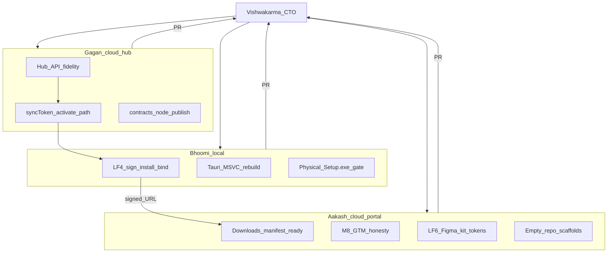

# AORMS active delivery — named agent crew

**Status:** ACTIVE (suite S-waves complete baseline) · **Date:** 2026-08-07  
**Parent:** [ROADMAP.md](ROADMAP.md) · [AORMS-SUITE.md](AORMS-SUITE.md)

## Solo mode

Suite law landed (S0–S5). **Open queue:** D6 signed installers · full BBSApp domain
split into Estimation/BBS/PM WinUI · Postgres→Mongo migration completion.

| Name | Role | Runtime | Owns now |
| --- | --- | --- | --- |
| **Bhoomi2** | Solo delivery | This Windows Cursor chat | D6 · domain UI split · doc truth |
| **Vishwakarma** | CTO / orchestrator | Parked | Resume → merge queue |
| **Gagan** | Cloud hub / sync | Parked | Resume → Mongo migration depth |
| **Aakash** | Portal / GTM | Parked | Resume → downloads honesty |
| **Bhoomi** | Cloud desktop | Parked | Optional parallel |

### Live roster (2026-08-06 — crew on Claude Opus 4.8 High)

| Name | Agent | Focus now |
| --- | --- | --- |
| **Vishwakarma** | [Roadmap orchestrator](https://cursor.com/agents/bc-dedaa2fa-3738-47a0-9d7b-3f477239445f) | Merge queue · roadmap truth |
| **Bhoomi** | [Bhoomi](https://cursor.com/agents/bc-e0ff0191-1bc6-589b-9c9a-5e87f0551b20) | LF4 WinUI · Windows sign + physical bind |
| **Gagan** | [Gagan](https://cursor.com/agents/bc-a60a5bde-f8ab-5c12-9257-2500e372c385) | Hub bind readiness · `0227` verify |
| **Aakash** | [Aakash](https://cursor.com/agents/bc-0ecc1c8f-732c-5c84-9439-c6f40b094465) | Portal `/downloads` wire-up on signed handoff |

Merge wave **#55 → #56 → #51 → #53 → #54 → #49 → #57** is on `main`. LF5/LF6 +
hub bind complete; LF4 remaining gates are human/ops (Windows sign, hub `0227`
prod, signed URL + sha256 → Aakash).

## Hard boundaries

| Rule | Why |
| --- | --- |
| **Do not** put CAD entities in Mongo | ShilpiDB only |
| **Do not** recompute BBS/estimates in cloud | `bbs_engine` SoT |
| **Do not** invent SaaS SKUs | Deferred OSS |
| **Do not** edit `Projects.tsx` / `Clients.tsx` | Parallel WIP |

## Sibling repos

| Repo | Role |
| --- | --- |
| [AQC](https://github.com/HolagundiWorks/AQC) | Engine + three technical shells |
| [AStudio](https://github.com/HolagundiWorks/AStudio) · [AConsulting](https://github.com/HolagundiWorks/AConsulting) | Practice managers |
| [ADraft](https://github.com/HolagundiWorks/AADT) · [shilpidb](https://github.com/HolagundiWorks/shilpidb) | Drafting · geometry |
| esti / aorms | Hub · portals · Mongo ops · marketing |
