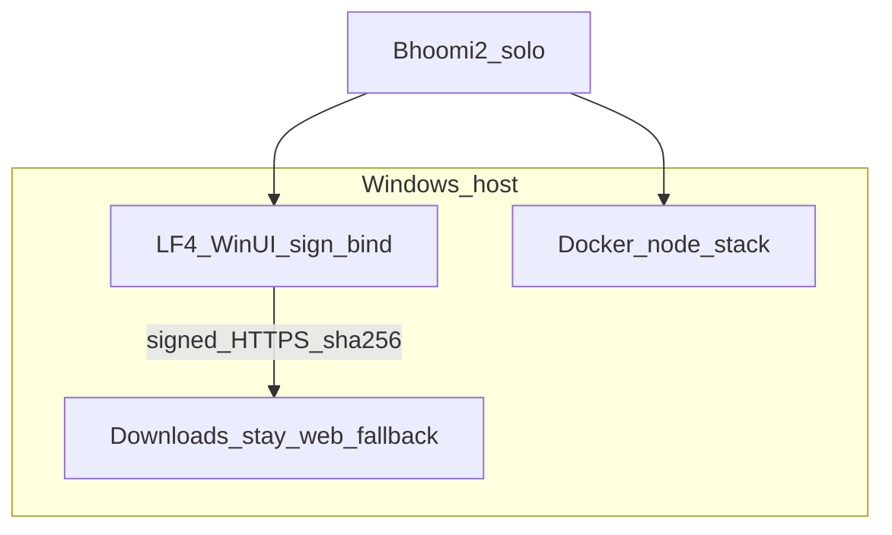

# AORMS active delivery — named agent crew

**Status:** ACTIVE · **Date:** 2026-08-06  
**Parent:** [ROADMAP.md](ROADMAP.md) · morning checklist [MORNING-TEST-LF4.md](MORNING-TEST-LF4.md)

## Solo mode (current)

Cloud agents (**Vishwakarma**, **Gagan**, **Aakash**, cloud **Bhoomi**) are
**stopped** (model expired). **Bhoomi2** is the only active agent and absorbs
orchestration + LF4 + interim portal honesty until the crew restarts.

| Name | Role | Runtime | Owns now |
| --- | --- | --- | --- |
| **Bhoomi2** | Solo delivery | This Windows Cursor chat | Roadmap truth · LF4 WinUI build/sign/bind · local hub `0227` · keep `/downloads` gated |
| **Vishwakarma** | CTO / orchestrator | Parked | Resume → merge queue only |
| **Gagan** | Cloud hub / sync | Parked | Resume → hub/contracts |
| **Aakash** | Cloud portal / GTM | Parked | Resume → live installer URL after Bhoomi2 handoff |
| **Bhoomi** | Cloud desktop env | Parked | Optional parallel LF4 |

### Live roster

| Name | Agent | Focus now |
| --- | --- | --- |
| **Bhoomi2** | This chat (*Bhoomi2*) | **Solo queue** — see [ROADMAP.md](ROADMAP.md) “Now” table |
| Vishwakarma · Gagan · Aakash · Bhoomi | Parked | Do not wait on them |

Prior merge wave **#55 → #56 → #51 → #53 → #54 → #49 → #57** remains on `main`.
Landing morphic redesign (rail · stage · soft/glass · tray clock) stays shipped.

## Hard boundaries (still)

| Rule | Why |
| --- | --- |
| **Do not** extract AStudio / AConsulting app code | [DESKTOP-REPOS.md](DESKTOP-REPOS.md) gate still open |
| **Do not** touch Stripe / W4 integrations | Deferred by choice |
| **Do not** edit `Projects.tsx` / `Clients.tsx` | Parallel WIP |
| **Do not** invent sha256 or flip live installer URLs unsigned | Honesty / M8 |
| Update [ROADMAP.md](ROADMAP.md) + this file when status flips | Change rule |

## Crew sync matrix (historical + solo)

| Surface | Owner | PR / branch | Notes |
| --- | --- | --- | --- |
| Hub `syncToken` · `0227` · LF3 · bind readiness | Gagan (parked) / **Bhoomi2** local | **#45/#48/#53** ✅ | Local `0227` apply = Bhoomi2 |
| CI lint · worker ruff | Vishwakarma (parked) | **#55/#56** ✅ | On `main` |
| LF5 · LF6 | Aakash (parked) | **#51/#54** ✅ | On `main` |
| **WinUI 3** shell · sign · bind | **Bhoomi2** | **#49** ✅ code | Physical gate open |
| Portal WinUI wording | Aakash (parked) / **Bhoomi2** gate | **#50** | Keep `web_fallback` |

---

## Bhoomi2 — solo Windows delivery (this chat)

**Owns:** Roadmap accuracy · LF4 physical gate · local stack · interim portal gate.  
**Does not:** invent release hashes · force-push · Stripe/W4 · repo extraction.

### Queue

1. Keep Docker node stack healthy (`start-node.ps1`).
2. Apply / verify `0227_hlp_org_sync_firm.sql` on local `esti-db`.
3. `build-winui.ps1 -Profile STUDIO` · launch vs Vite `5173`.
4. Sign with operator cert when available; measure sha256.
5. Bind: firm admin → `DesktopLicenceBind` → `hasSyncToken` / `sync.capabilities`.
6. Only then host HTTPS + fill manifests / `VITE_*_INSTALLER_URL`.

### Key paths

- `desktop/AStudio.Shell/` · `desktop/scripts/build-winui.ps1` · `start-node.ps1`
- [MORNING-TEST-LF4.md](MORNING-TEST-LF4.md) · [LOCAL-FIRST.md](LOCAL-FIRST.md) · [ROADMAP.md](ROADMAP.md)

### Done when

- [x] Solo roadmap + this roster updated  
- [x] Host toolchain + Docker stack up  
- [x] Local `0227` verified  
- [x] WinUI publish runs against local SPA (process up)  
- [x] ACO **dev**-signed artifact + sha256 recorded (SmartScreen trust still open)  
- [x] `hasSyncToken` bind confirmed (API smoke · VALID · metaSync)  
- [ ] HTTPS handoff fields ready (or still gated)  
- [ ] Production / SmartScreen-trusted cert (operator)  
- [ ] `sync.pullMeta` clean against real hub URL (not loopback quirk)

---

## Parked role cards (resume later)

### Vishwakarma — orchestrator

Merge green PRs · roadmap truth · no day-to-day WinUI when Bhoomi2 is live.

### Gagan — hub / sync

`syncToken` · HUB-API · `@esti/contracts` · no desktop packaging.

### Aakash — portal / GTM

`/downloads` live URL flip **after** signed HTTPS + sha256 from Bhoomi2.
LF5/LF6 already ✅ on `main`.

### Bhoomi — cloud desktop env

Optional `env.name=bhoomi` assist; physical Windows gate stays Bhoomi2.
