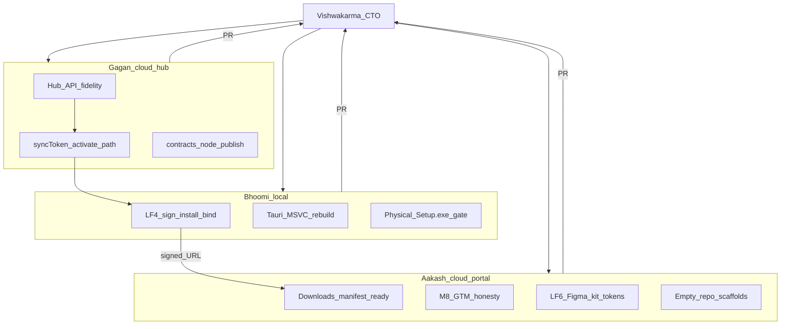

# AORMS active delivery — named agent crew

**Status:** ACTIVE · **Date:** 2026-08-06  
**Parent:** [ROADMAP.md](ROADMAP.md) · morning checklist [MORNING-TEST-LF4.md](MORNING-TEST-LF4.md)

Four agents. Call them by name in handoffs and PRs.

| Name | Role | Runtime | Owns |
| --- | --- | --- | --- |
| **Vishwakarma** | CTO / orchestrator | Cloud or local | Coordination · merge to `main` · roadmap truth |
| **Bhoomi** | Local desktop | This Windows machine | LF4 sign · install · licence bind |
| **Gagan** | Cloud hub / sync | Cloud | `syncToken` · hub APIs · `@esti/contracts` |
| **Aakash** | Cloud portal / GTM | Cloud | Downloads · M8 · LF6 · empty scaffolds |

## Hard boundaries

| Rule | Why |
| --- | --- |
| **Do not** extract AStudio / AConsulting app code | [DESKTOP-REPOS.md](DESKTOP-REPOS.md) gate still open |
| **Do not** touch Stripe / W4 integrations | Deferred by choice |
| **Do not** edit `Projects.tsx` / `Clients.tsx` | Parallel WIP |
| **Bhoomi** owns signing + physical install | Windows cert + UAC / SmartScreen |
| **Gagan** owns hub / sync / licence mint | Backend + contracts; no Tauri |
| **Aakash** owns portal / docs / manifests / GTM | Frontend public surfaces |
| **Vishwakarma** owns merge to `main` | Single integration owner |
| Update [ROADMAP.md](ROADMAP.md) + this file when status flips | Change rule |

## Crew sync matrix

| Surface | Owner | PR / branch | Notes |
| --- | --- | --- | --- |
| Hub `syncToken` mint · `firmFromSyncToken` · `0227` · LF3 `domainMeta` · `@esti/contracts` | **Gagan** | **#45** `cursor/hub-sync-contracts-9937` | Merge to `main` **first** |
| Tauri / installer / signing · first-run bind UX (`DesktopLicenceBind`) | **Bhoomi** | `orch/lf4-sync-bind-installer` | Rebase after #45; **drop duplicate hub/sync/docs** |
| Portal Downloads / GTM / LF5–LF6 | **Aakash** | `#46` ✅ · LF5 lane | Live URL waits on Bhoomi signed Setup.exe; LF6 right-slot open |

**Merge order (Vishwakarma):** land **#45** (Gagan hub/sync/contracts) before the LF4
desktop branch. LF4 will rebase onto `main` and drop overlapping hub files
(`licenseApi/service.ts`, `license/consumer.ts`, `sync/*`, contracts
`licensing-platform.ts`, HUB-API / LOCAL-FIRST / ROADMAP / AGENT-WORKSTREAMS /
DESKTOP-REPOS). Gagan does **not** own `desktop/` packaging or
`DesktopLicenceBind`.

---

## Vishwakarma — CTO / orchestrator

**Owns:** Crew briefs · handoffs · conflict resolution · **merge to `main`** ·
roadmap status accuracy.

### Responsibilities

1. Keep Bhoomi / Gagan / Aakash on hard boundaries; reassign if a PR crosses streams.
2. Prefer **separate PRs per workstream**; rebase when Gagan and Aakash both touch
   `ROADMAP.md` / this file (append status lines, don’t rewrite tables).
3. **Merge** green workstream PRs into `main`; do not land unsigned installer URL
   flips or app-code extraction.
4. Update [ROADMAP.md](ROADMAP.md), this file, [MORNING-TEST-LF4.md](MORNING-TEST-LF4.md)
   when status flips.
5. Gate Bhoomi → Aakash handoff: only after **signed** Setup.exe + sha256 exist.

### Out of scope alone

- Physical code-signing / UAC (operator with Bhoomi).  
- Inventing Stripe / W4 / repo extraction work.

---

## Bhoomi — Local desktop

**Owns:** LF4 physical gate · Tauri / installer · morning operator checklist.  
**Chat:** this session.

### Goals

1. Prefer **MSVC** toolchain (VS Build Tools → Desktop C++) over WinLibs when UAC allows; rebuild Studio Setup.exe.
2. **Code-sign** `desktop/artifacts/AORMS-Studio_0.1.0_x64-setup.exe` (or rebuilt artifact).
3. Run [MORNING-TEST-LF4.md](MORNING-TEST-LF4.md) physical install: admin sign-in → panel activate → `hasSyncToken` → sync flush.
4. Optional: rebuild **CONSULTANCY** profile installer once Studio path is green.
5. Hand signed asset URL + sha256 to **Aakash** for portal wire-up (do not publish unsigned).

### Out of scope

- Portal download URL flips until signing is done (prep only on Aakash).
- Hub API redesign (Gagan).
- Repo extraction.
- Merging to `main` (Vishwakarma).

### Key paths

- `desktop/` · `desktop/scripts/build-installer.ps1` · `desktop/src-tauri/`
- `MORNING-TEST-LF4.md` · [LOCAL-FIRST.md](LOCAL-FIRST.md) LF4

### Done when

- [ ] Signed Studio Setup.exe exists and installs on this Windows host  
- [ ] First-run licence bind yields hub `syncToken` + meta sync works  
- [ ] Artifact path + sha256 noted for Aakash  
- [ ] Vishwakarma has merged the LF4 code PR (unsigned artifact ok in branch; URLs stay gated)

---

## Gagan — Cloud hub / sync / contracts

**Owns:** Cloud hub fidelity for desktop nodes · licence → `syncToken` · contracts for DESKTOP-REPOS gate.

### Goals

1. Verify end-to-end **panel activate / refresh → sync bearer** against
   [HUB-API.md](HUB-API.md) (`2026-08`): `/platform/v1/activate`, refresh,
   `firmFromSyncToken` (legacy + `hlp_device`), node `license.activate` persistence.
2. Harden or document gaps in `sync.*` (flush, pullMeta, capabilities, hubConfigured)
   for desktop `ESTI_ROLE=node` clients — no breaking changes without bumping hub version.
3. Advance DESKTOP-REPOS gate item: **`@esti/contracts` (or OpenAPI) published for node clients**
   — package export / version note / consumer README; do **not** invent a second contracts repo.
4. Spot-check LF3 domain meta enqueue/apply (`domainMeta.ts`, task / estimate /
   phaseProgress) for regressions from overnight work; fix only if broken.
5. Keep [HUB-API.md](HUB-API.md) and [LOCAL-FIRST.md](LOCAL-FIRST.md) in sync with code.

### Out of scope

- Tauri / installer / code signing (Bhoomi).  
- Portal download UI / marketing copy (Aakash).  
- Stripe, W4, repo extraction of app code.  
- Merge to `main` (Vishwakarma).

### Key paths

- `backend/src/modules/sync/` · `backend/src/lib/sync/`  
- `backend/src/modules/license/` · `backend/src/licensing-platform/`  
- `packages/contracts/` (esp. sync)  
- `docs/esti/HUB-API.md` · `LOCAL-FIRST.md`

### Done when

- [x] Activate → syncToken path reviewed / fixed; documented in HUB-API if behaviour changed — **merged #45**  
- [x] Contracts publish path for node clients clear (`@esti/contracts` `0.1.0` + README)  
- [x] ROADMAP / DESKTOP-REPOS gate checkbox updated (`0227` on `main`)  
- [x] PR opened for Vishwakarma to merge — **#45 merged**  

**Deploy note for Bhoomi:** hub must apply migration `0227_hlp_org_sync_firm.sql` before morning bind.

---

## Aakash — Cloud portal / GTM / UX parity

**Owns:** Web Portal readiness for signed installers · M8 honesty · LF6 leftovers · empty repo scaffolds.

### Goals

1. Prep `/downloads` + `update-manifests/{astudio,aconsulting}.json` so plugging a
   **signed** URL + sha256 is a one-line env / JSON fill (see DESKTOP-REPOS
   “Portal → installer wiring”). Do **not** point at unsigned overnight binaries.
2. Finish **LF6** open piece: Figma ↔ `@hcw/ui-kit` token sync notes or automation
   stub — UX parity checklist polish only; no hero redesign.
3. **M8 GTM:** scrub any remaining “web-only / no desktop” contradictions on public
   surfaces; keep download CTAs honest (`web_fallback` until Bhoomi signs).
4. Optionally create **empty** GitHub `AStudio` / `AConsulting` from
   `docs/esti/repo-scaffolds/` READMEs only — **no app code move**.
5. Align [WEB-PORTAL.md](WEB-PORTAL.md) / MARKET-FIT M8 item 4 status with Bhoomi’s
   publish signal (leave 🔲 until signed URL exists).
6. **LF5** web parity polish: capability badges, degraded AI UX, shared keymap / Help.

### Out of scope

- Building or signing Setup.exe (Bhoomi).  
- Hub syncToken mint logic (Gagan).  
- Extracting SPA into sibling repos.  
- Merge to `main` (Vishwakarma).

### Key paths

- `frontend/src/routes/Downloads.tsx` · `DocsHub.tsx` · `AccountPortal.tsx`  
- `frontend/src/lib/portal-downloads.ts` · `frontend/public/update-manifests/`  
- `frontend/src/lib/keymap.ts` · `CapabilityBadge.tsx` · `routes/Help.tsx`  
- `frontend/src/content/blog/` · landing SEO / nomenclature imports  
- `docs/esti/repo-scaffolds/` · [DESKTOP-WEB-PARITY-UX.md](DESKTOP-WEB-PARITY-UX.md) LF5–LF6

### Done when

- [x] Manifest / env wiring ready for signed assets (placeholders documented) — **merged #46**  
- [x] M8 copy honesty pass complete  
- [x] LF6 Figma/token item advanced or explicitly scoped with next step  
- [x] Optional empty GitHub scaffolds created without app code (`docs/esti/repo-scaffolds/`)  
- [x] PR opened for Vishwakarma to merge — **#46 merged**  
- [x] LF5 capability badges · Hosted AI UX · shared keymap + `/help`  

**Still 🔲:** live download URL flip (wait on Bhoomi signed Setup.exe + sha256).  
**Still 🔲:** LF6 inspector / Ask ESTI right-slot polish.

---

## Handoffs

| From → To | Artifact |
| --- | --- |
| Bhoomi → Aakash | Signed Setup.exe URL, version, sha256 |
| Gagan → Bhoomi | Confirm activate→syncToken API ready for morning bind test |
| Aakash → Bhoomi | Exact env vars / JSON fields to fill after signing |
| Any workstream → Vishwakarma | Green PR targeting `main` |
| Vishwakarma → ROADMAP | Flip ✅ / 🚧 in merge commit or follow-up |

## Coordination

- Prefer **separate PRs** per agent.  
- If Gagan and Aakash both touch `ROADMAP.md`, Vishwakarma rebases — append status lines.  
- Bhoomi should not wait on Aakash; Aakash waits on Bhoomi for live download URLs.  
- Vishwakarma does not merge portal installer URL flips until Bhoomi’s handoff is signed.
