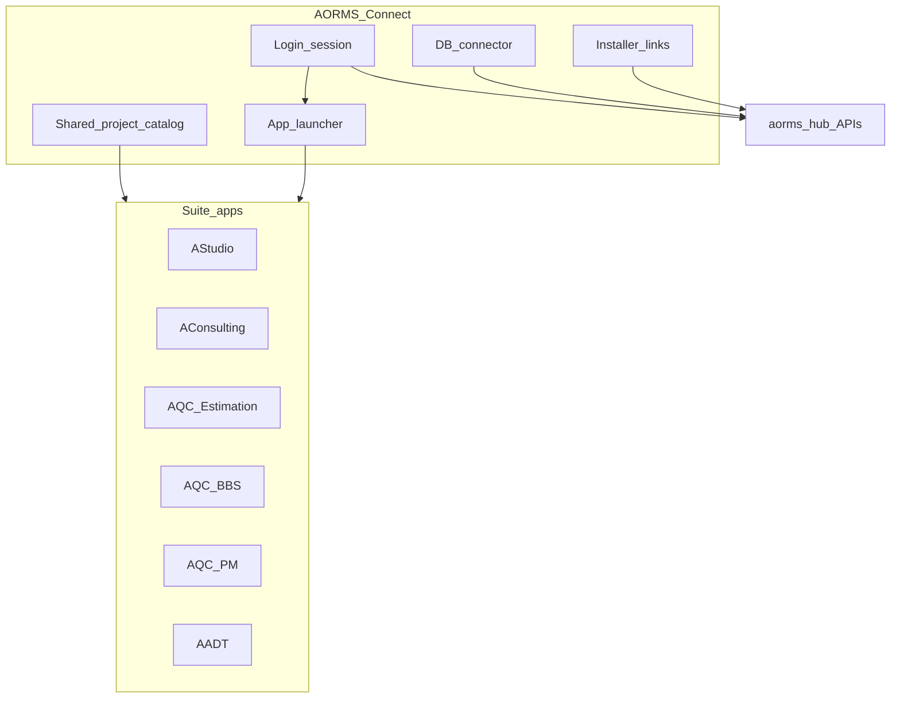

# AORMS Connect

**Status:** Canonical product law · **Updated:** 2026-08-08  
**Package id:** `in.aorms.connect` · **Repo:** [AORMS-Connect](https://github.com/HolagundiWorks/AORMS-Connect)  
**Suite:** [AORMS-SUITE.md](AORMS-SUITE.md) · **Runtime:** [LOCAL-FIRST.md](LOCAL-FIRST.md) · **Roadmap:** [ROADMAP.md](ROADMAP.md) C0–C3

**AORMS Connect** is the **suite core desktop app** — single login, launcher,
shared firm/project catalog, DB connector, and installer links for every suite
app. It is **not** a practice manager and **not** a rename of AStudio.

| Owns | Does **not** own |
| --- | --- |
| Firm **login / session** (SSO for the suite) | AStudio / AConsulting practice UI |
| **Launcher** for installed suite apps | Technical calc (BOQ / BBS / programme) |
| **Online installer links** (from hub `/update-manifests`) | Drawing entities (ShilpiDB) |
| **Shared firm catalog** — projects + identity across apps | Money calc · CAD |
| **DB connector** — local firm store + hub / Mongo bind | Full Licence Manager UI (**C3 future**; stub only) |
| Licence **status** stub | Staff ERP on `aorms.in` apex |

---

## Session model (SSO)

1. User signs in **only in Connect** (hub auth).  
2. Connect persists session + `syncToken` (or successor) under  
   `%LocalAppData%\AORMS-Connect\` (shared firm store: `firm.db` via Bridge).  
3. Suite apps launch from Connect with Connect-issued credentials — **no per-app login**.  
4. **C2 (shipped):** Connect writes `session.json` after Activate; suite apps import it via `AormsBridge.TryImportConnectSession` (default path or `--connect-session`). Product UX remains Connect-only login.

### C2 session / catalog contract

| Artifact | Path / API | Writer | Readers |
| --- | --- | --- | --- |
| Bridge firm DB | `%LocalAppData%\AORMS-Connect\firm.db` | Connect Activate / Flush | Connect |
| Session export | `%LocalAppData%\AORMS-Connect\session.json` | Connect after Activate | Suite apps via Bridge `ConnectSession` |
| Project catalog | `%LocalAppData%\AORMS-Connect\catalog.json` | Connect UI (`ConnectCatalog`) | Suite apps via `ConnectCatalog.List` |
| Hub | `ESTI_HUB_URL` · activate · ops | Connect | Apps via shared `syncToken` |

**Bridge API (AQC SoT — `Aorms.Bridge`):**

- `ConnectSession` / `ConnectSessionFile` — read/write `session.json`; CLI flag `--connect-session`.  
- `ConnectCatalog` / `CatalogProject` — read `catalog.json` (`id`, `ref`, `title`, `status`, `updatedAt`).  
- `AormsBridge.TryImportConnectSession(overwrite:)` — apply session into the app’s `firm.db`.

**Rules for C2:**

- Connect is the **only** desktop surface that runs full user login against the hub.  
- On successful Activate, write `session.json` with `{ syncToken, hubUrl, licenseApiUrl, licenseToken, deviceId, writtenAt }` (`expiresAt` / `userId` optional).  
- Sibling apps import the default `session.json` at bridge create (`overwrite: true`); Connect Open also passes `--connect-session`. Do **not** prompt for HLP key when a valid session exists.  
- `catalog.json` entries use stable UUID `id` + firm `ref` + `title` + `status`; apps must not invent parallel project ids for the same engagement.  
- Soft-launch marketing gate (`VITE_MARKETING_ONLY`) is **unrelated** — do not flip apex login as part of Connect work.

## Project catalog (consistency)

Connect owns the **canonical project register** (id, ref, title, status).  
Connect writes `catalog.json`; siblings read via `ConnectCatalog` (C2). Apps may
append published meta via Bridge; they do not fork divergent project identities.

## Launcher + installers

| Action | Behaviour |
| --- | --- |
| Detect install | Known package ids / install paths per suite app |
| Open | Launch installed WinUI / MSIX app |
| Get installer | Open online link from hub manifests (`/update-manifests/*.json`) — Coming soon until D6 signed URLs |

Connect itself is listed on `/downloads` (`aorms-connect` offer) — Coming soon until D6.

## DB connector

- Local SQLite (`firm.db`) beside session store — Bridge `AormsBridgeHost`.  
- Hub bind for Mongo ops + sync meta (same Bridge lineage as AQC apps).  
- **Connect UI (shipped):** firm.db path · hub syncReady · pending meta/artifact outbox counts · **Enqueue test meta** · **Flush to hub** · last result log.  
- Bridge: `OutboxCounts()` · `FlushAsync()` · `EnqueueMeta()`.  
- **Web:** hub **Connection manager** (`/ops-db` · Admin menu · [`OpsDbManager.tsx`](../../frontend/src/routes/OpsDbManager.tsx)) browses published Mongo ops + `esti_sync_record` / `esti_meta_event` after Flush — it does **not** edit `firm.db` ([LOCAL-FIRST.md](LOCAL-FIRST.md)).

## Licence Manager (C3)

Connect shows **local seat status** (licence state, install id, hub / license API
URLs, `firm.db` + `session.json` paths) and links to the operator console at
`admin.aorms.in` (**HCW License Manager**). Actions: copy install id, rewrite
`session.json` from `firm.db`, clear local tokens (does not revoke on hub).

Full issue / revoke / device admin stays on `admin.aorms.in` — not duplicated in
Connect. Do not invent Stripe / Standard licence metering in Connect copy.

Bridge: `AormsBridge.LicenceSnapshot()` · `ClearLocalLicence()`.

---

## Delivery waves

| Wave | Outcome | Status |
| --- | --- | --- |
| **C0** | This canon + nomenclature + downloads stub | ✅ |
| **C1** | WinUI shell: login · launcher · installer links · projects list · licence stub | ✅ |
| **C2** | Session broker + catalog API for sibling apps | ✅ |
| **C3** | Licence Manager surface (local status + admin link) | ✅ |

See [ROADMAP.md](ROADMAP.md).

## Rejects

- Mega-app that absorbs AStudio + Estimation + CAD  
- Per-app login as the primary suite UX  
- Staff ERP login on apex marketing site instead of Connect  
- Divergent firm.db per app with no Connect catalog (long-term)  
- Claiming signed Connect Setup.exe before D6  
