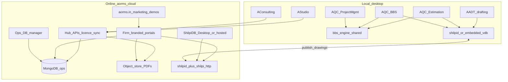

# AORMS Suite Architecture

**Status:** Canonical product law · **Updated:** 2026-08-07  
**Locked:** AQC → **three separate installers** sharing `bbs_engine` · **MongoDB** for all non-drawing cloud ops/comms · **ShilpiDB** for drawings · **AADT** for drafting  
**Runtime:** [LOCAL-FIRST.md](LOCAL-FIRST.md) · Bridge: [PORTAL-SYNC-BRIDGE.md](PORTAL-SYNC-BRIDGE.md) · Repos: [DESKTOP-REPOS.md](DESKTOP-REPOS.md)

**AORMS** is the **suite brand and cloud spine**, not a single mega-app.

| Plane | Principle |
| --- | --- |
| **Technical work** | Always **local** — drafting, quantities, BBS, schedules, AI assist on drawings |
| **Practice management** | **Local-first apps** that sync **published** ops data to the cloud |
| **Communications** | **Online** — firm-branded portals + hub APIs |
| **Drawings** | **ShilpiDB** (`.vdb` + spatial index) — shared geometry across apps |
| **Everything else online** | **MongoDB** (firm-scoped) — tasks, office, HR, payroll summaries, portal threads, meta |

Calculations never move to the cloud. Portals never see drafts. ShilpiDB never stores payroll; Mongo never stores CAD entities.

---

## Practice managers

| App | Repo | Owns | Does **not** own |
| --- | --- | --- | --- |
| **AStudio** | [AStudio](https://github.com/HolagundiWorks/AStudio) | Tasks, Office, HR, Payroll views, client/third-party **comms**, project register, portal publish | BOQ calc, BBS math, CAD entities |
| **AConsulting** | [AConsulting](https://github.com/HolagundiWorks/AConsulting) | Same manager surface for engineering practices | Same technical exclusions |

Local SQLite/`firm.db` for drafts; flush published ops to **MongoDB** via hub (`syncToken`).

## Technical apps (AQC lineage — three installers)

Shared: C++ **`bbs_engine`**, licence activate, `Aorms.Bridge`, ShilpiDB client.

| App | Role | Publishes |
| --- | --- | --- |
| **AQC Estimation** | Rate books, BOQ, measurement book | Estimate totals / issued PDFs |
| **AQC BBS** | Bar bending, steel recon | Issued BBS PDFs, kg summaries |
| **AQC Project Management** | Programme, packages, RA/progress (AProc) | Milestones %, RA certs, progress reports |

Monolithic [AQC](https://github.com/HolagundiWorks/AQC) = **engine + reference**; packaging = three MSIX identities.

## Drafting + geometry

| Component | Role |
| --- | --- |
| **AADT** | Local 2D CAD — [AADT](https://github.com/HolagundiWorks/AADT) |
| **ShilpiDB** | Geometry store — [shilpidb](https://github.com/HolagundiWorks/shilpidb); `shilpi-http` for non-Rust hosts |

## Online surfaces

| Surface | Purpose |
| --- | --- |
| **aorms.in** | Marketing · blog · downloads — **not** staff ERP |
| **Soft launch (2026-08)** | Landing + blog live; apex login / installers **Coming soon** (`VITE_MARKETING_ONLY`) |
| **Firm portals** | Updates · Project · Progress · Drawings · Documents (published only) |
| **Hub APIs** | Activate → `syncToken` · ops ingest · artifacts · portal auth |
| **Ops DB manager** | Browse Mongo firm data (`/ops-db` staff console) |
| **Shilpi Desktop / hosted** | Geometry admin (not CAD) |
| **admin.aorms.in** | Licence Manager |

**Roadmap:** [ROADMAP.md](ROADMAP.md) · **Repos:** [DESKTOP-REPOS.md](DESKTOP-REPOS.md) · **VPS:** [VPS-INSTALL.md](VPS-INSTALL.md)  
**Updated:** 2026-08-08

---

## Data placement

| Data class | Local | MongoDB | Shilpi / object store |
| --- | --- | --- | --- |
| Task drafts | Yes | Published status | — |
| HR / payroll worksheets | Yes | Payslip meta + PDF keys | PDF bytes |
| Portal approvals | Optional mirror | **Authoritative** | — |
| BOQ / BBS / programme scratch | Technical apps | Issued totals only | PDFs |
| CAD entities | AADT + Shilpi | Refs only (`drawingPackageId`) | `.vdb` / packages |
| AI transcripts | Local only | Never | Never |

**Mongo collections (firm-scoped):** `firms`, `projects`, `tasks`, `office_docs`, `hr_events`, `payroll_runs`, `portal_threads`, `meta_events`, `sync_cursors`, `published_artifacts`.

Postgres in this monorepo is **transitional** until hub APIs are fully Mongo-backed — do not dual-write forever.

---

## AI (suite)

| Layer | Runtime |
| --- | --- |
| Desktop technical | Local instruct (Ollama / Foundry Local) |
| Vision / sheets | Local VL inside AADT |
| Portal chat (optional) | Cloud API on **published** context only |
| Embeddings | Local, beside Shilpi `SpatialGrid` |

**Propose, never auto-commit** geometry or money.

---

## Delivery waves

| Wave | Outcome | Status |
| --- | --- | --- |
| **S0–S5** | Canon · Mongo · Shilpi · AQC packaging · Manager Tasks · ops DB | ✅ |
| **S6–S7** | Soft-launch marketing · VPS · PRODUCTION-OPS · agent law | ✅ |
| **S8** | Reopen apex auth / portal demos (`VITE_MARKETING_ONLY=false`) | 🔲 |
| **S9** | Per-app MSIX (AQC-* repos) | 🔲 |
| **S10** | Firm portal depth | 🔲 |
| **D6** | Signed installers + portal tenants | 🔲 |

See [ROADMAP.md](ROADMAP.md).

## Rejects

- Mega-app that is both CAD and payroll  
- Recomputing BBS/estimates in Mongo or the browser  
- CAD entities in Mongo  
- Staff ERP on `aorms.in` apex  
- Dual long-term SoT (Postgres + Mongo) for the same ops docs  
