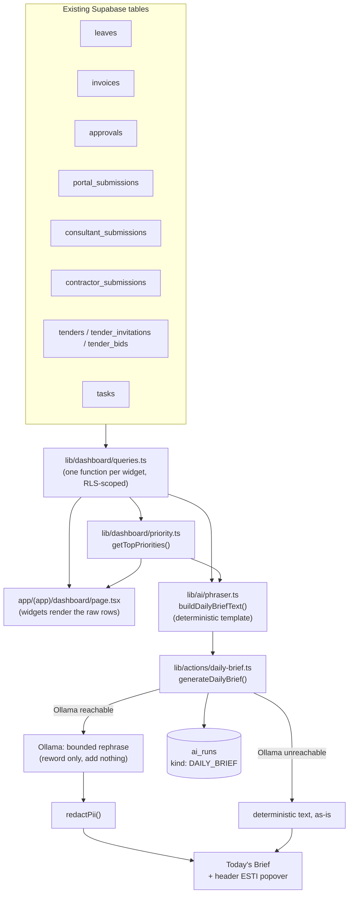

# Dashboard redesign & ESTI as a grounded phraser

Canonical reference for the 2026-09-10 dashboard redesign — real-data
widgets, top-3 priority ranking, and ESTI's new role as a phraser over
that same data rather than a general chatbot. Read this before touching
`app/(app)/dashboard/page.tsx`, `lib/dashboard/*`, or `lib/ai/phraser.ts`.

## Why this exists

The dashboard already showed real data (KPIs, My Tasks, Scheduled
Meetings, Site Updates, Decisions Awaiting Client) — nothing fabricated.
What was missing was a sense of *what needs attention today*: absences,
billing readiness, unpaid invoices, open client/consultant requests,
tenders awaiting bids, and a ranked view of the most urgent items across
all of that. Explicit direction from the user shaped ESTI's role too:
not a general AI chatbot, but a "phraser" that turns the studio's own
real data into a natural-language brief — grounded, nothing invented,
nothing beyond what's actually in the data.

## Data flow



**The retrieval is real SQL, not vector search.** "RAG" here means: the
generation step (deterministic template, optionally rephrased by Ollama)
is grounded in data the app actually queried moments earlier — the same
rows the dashboard widgets render, not a summary of a summary. A full
document-level RAG layer (pgvector + embeddings over MoMs, transmittals,
site notes, etc.) is a separate, already-documented backlog item —
`docs/esti/ROADMAP.md` § "Module 7 — RAG Layer" (P-4, paid-tier,
unstarted) — and stays out of scope here. This dashboard/phraser feature
doesn't touch that backlog item at all; it's the achievable version of
"grounded retrieval + phrasing" using structured data the app already
has, not unstructured document search.

## Priority scoring (`lib/dashboard/priority.ts`)

Deliberately simple and transparent — no ML, no black box:

```
score = baseWeight(kind, priority) + min(ageDays × 3, 60)
```

| Item | Base weight |
| --- | --- |
| Task, priority CRITICAL | 100 |
| Task, priority HIGH | 70 |
| Pending client approval | 60 |
| Client request flagged CRITICAL revision | 80 |
| Open client request (other) | 55 |
| Task, priority MEDIUM | 40 |
| Open consultant request | 35 |
| Task, priority LOW | 20 |

`ageDays` is days overdue (tasks), days since sent (approvals), or days
since submitted (requests) — capped at a +60 bonus so an old low-priority
item can eventually surface, but can't out-rank a fresh CRITICAL task.
The top 3 by score become the dashboard's "Top 3 priorities today" and
feed straight into the brief's own top-priorities line.

## Disclosed gaps — not fabricated, stated plainly

- **No true invoice due-date.** `invoices` has `date_invoice` (issue
  date) only, no payment-terms due date. "Awaiting Payment" is
  "issued and unpaid, oldest first" — a proxy for overdue, not a
  contractual one. Stated in the widget's own data, not hidden.
- **"Ready to bill" means drafted, not un-invoiced billable hours.**
  There's no time-entry/unbilled-work table in this schema. A DRAFT
  invoice's own amount is the closest honest real-data mapping to "what
  you could bill today."
- **Contractor Submissions renders empty.** Nothing in the app writes to
  `contractor_submissions` yet (confirmed via a full codebase search
  before this redesign) — the widget still queries and renders it, with
  its own explicit empty-state copy, rather than hiding the section and
  quietly losing the gap.

## ESTI is not a chatbot here

The header's "Ask ESTI" free-text question box is gone — no open-ended
questions. ESTI opens straight to the same brief the dashboard's own
"Today's Brief" tile shows, generated by the exact same
`generateDailyBrief()` Server Action. The old free-text action
(`lib/actions/ai.ts`'s `askEsti`) is unchanged and still exists in the
codebase — just not linked from the header anymore. Removing it outright
is a separate decision, not required by this redesign.

The Ollama rephrase step (`lib/ai/phraser.ts`'s `PHRASER_REPHRASE_SYSTEM`)
is deliberately narrow: "rephrase this exact text, do not add any fact,
name, number, or claim not already present in it." If Ollama can't be
reached, `generateDailyBrief()` falls back to the deterministic template
text as-is — same "always return something honest" resilience `askEsti`
already established, just with a guaranteed-correct default instead of a
"can't reach the model" apology.
