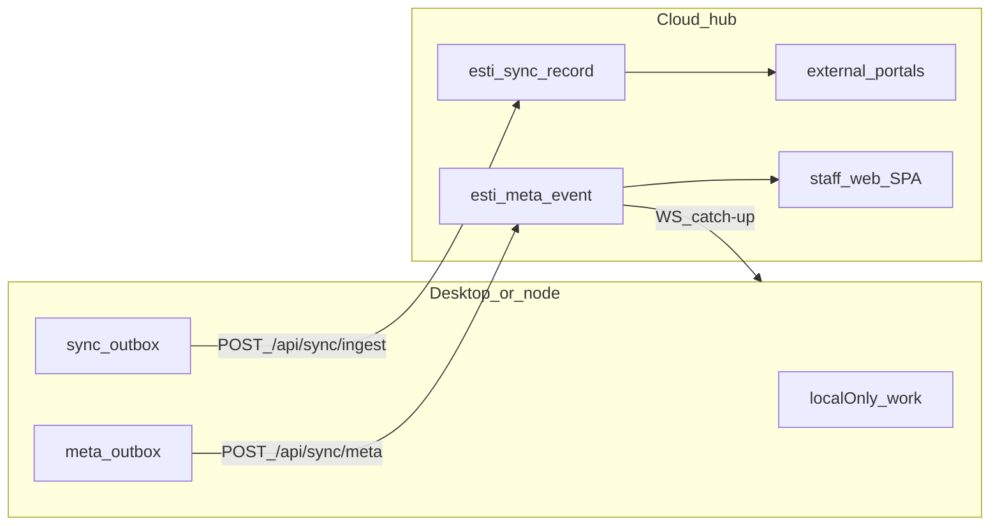

# AORMS local-first desktop + cloud hub

> **Canonical implementation doc** for the dual-runtime product.  
> **Status (2026-08):** LF0–LF3 ✅ · LF4 packaging/bind open (Bhoomi) ·
> **LF5** web parity polish ✅ (Aakash) · LF6 ◐ (token stub ✅ · right-slot 🔲).  
> Wire contract: [HUB-API.md](HUB-API.md) (`2026-08`) · contracts gate:
> [DESKTOP-REPOS.md](DESKTOP-REPOS.md) · crew: [AGENT-WORKSTREAMS.md](AGENT-WORKSTREAMS.md).  
> **Product law:** [PLANS-AND-TIERS.md](PLANS-AND-TIERS.md) · **UX parity:**
> [DESKTOP-WEB-PARITY-UX.md](DESKTOP-WEB-PARITY-UX.md) · **Identity:**
> [AORMS-IDENTITY.md](AORMS-IDENTITY.md) §10.

This document supersedes the 2026-07-19 **web-only** product law for runtime
shape. Estimating remains **in-product** (no separate Estimate desktop app).
Legacy Community / Manager installers stay retired.

## Decisions (locked)

| # | Choice |
| --- | --- |
| Firm sync | **Cloud hub** is the realtime metadata authority — every desktop is a peer (no LAN firm-server) |
| Online surface | **Full web parity** — same SPA on desktop (preferred / offline) and browser (degraded local AI/worker) |
| Design system | **`@hcw/ui-kit` only** — one chrome on both hosts ([DESKTOP-WEB-PARITY-UX.md](DESKTOP-WEB-PARITY-UX.md)) |

## Three planes

| Plane | Moves | Transport |
| --- | --- | --- |
| **Work / localOnly** | Drafts, BOQ lines, measurements, AI chats | Stay on the node until promote |
| **Metadata** | Tasks, status, cost scalars, progress % | Hub `esti_meta_event` + WS `/api/sync/meta/ws` |
| **Artifacts** | Issued PDFs, READY drawings, etc. | `esti_sync_outbox` → `POST /api/sync/ingest` |

Classification + field maps: [`packages/contracts/src/sync.ts`](../../packages/contracts/src/sync.ts).

## Runtimes

| Runtime | Role | Key env |
| --- | --- | --- |
| **Desktop node** | Preferred authoring path | `ESTI_ROLE=node`, `ESTI_DESKTOP=true`, `STORAGE_DRIVER=fs`, `INSTALL_ID`, local Ollama/EOMS |
| **Cloud hub** | Metadata SoT + published artifacts + portals + web SPA | `ESTI_ROLE=hub`, S3, licensing platform |
| **Web staff SPA** | Parity path (same SPA, hub API) | Browser → hub; AI/worker on hub or BYO |

Packaging stub: [`desktop/`](../../desktop/) · env: `desktop/env.desktop.example`.

## Licence / sync scope

| Mode | Local AI / worker | Metadata sync | Artifact push |
| --- | --- | --- | --- |
| Free / unbound desktop | Yes | No | No |
| Licensed desktop (`VALID`/`GRACE` + hub + syncToken) | Yes | Yes | Yes |
| Web parity | Hub / BYO | Yes | Server-side |

Runtime resolution: `trpc.sync.capabilities` ·
[`backend/src/lib/sync/runtimeCapabilities.ts`](../../backend/src/lib/sync/runtimeCapabilities.ts)
(server) · [`frontend/src/lib/runtimeCapabilities.ts`](../../frontend/src/lib/runtimeCapabilities.ts)
(SPA badges / host). Desktop sync caps require licence + hub URL + `syncToken`.

## Implementation waves

| Wave | Focus | Status |
| --- | --- | --- |
| **LF0** | Contracts: planes, `MetaEntity`, field maps, capability presets, tests | ✅ |
| **LF1** | Hub `esti_meta_event` + catch-up REST + WS; node meta outbox/cursor; drain tick | ✅ |
| **LF2** | Artifact content-hash; publish DTOs (tender/RA/siteReference/progressReport); portal-from-hub reads | ✅ |
| **LF3** | Domain enqueue of metadata (tasks, estimate totals, phase progress) + apply hooks on pull | ✅ Gagan 2026-08 |
| **LF4** | Signed desktop installer (Tauri + profile STUDIO\|CONSULTANCY); first-run licence bind | 🚧 Bhoomi — unsigned Studio Setup.exe · `DesktopLicenceBind` · sign + physical bind = morning ([MORNING-TEST-LF4.md](MORNING-TEST-LF4.md)) |
| **LF5** | Web parity polish: capability badges, degraded AI UX, shared keymap / Help | ✅ Aakash — `CapabilityBadge` · `frontend/src/lib/keymap.ts` · `/help` · `resolveRuntimeCapabilities` web-parity fix |
| **LF6** | UX parity checklist + inspector/AI right-slot; Figma token sync to kit | ◐ Aakash — [FIGMA-TOKEN-SYNC.md](FIGMA-TOKEN-SYNC.md) stub ✅ · right-slot 🔲 |

**Migrations:** `0226_local_first_sync.sql` · `0227_hlp_org_sync_firm.sql` (panel sync firm UUID).

## Key APIs & modules

| Surface | Path |
| --- | --- |
| Wire contract | [HUB-API.md](HUB-API.md) (`2026-08`) |
| Artifact ingest | `POST /api/sync/ingest` — [`routes.ts`](../../backend/src/modules/sync/routes.ts) |
| Meta append / catch-up / WS | `/api/sync/meta*` — same |
| Node tRPC | `sync.status` · `flush` · `enqueueMeta` · `pullMeta` · `capabilities` · `hubConfigured` |
| Panel activate → sync bearer | `/platform/v1/activate` · `license.activate` ([HUB-API.md](HUB-API.md)) |
| Capability resolution | [`backend/src/lib/sync/runtimeCapabilities.ts`](../../backend/src/lib/sync/runtimeCapabilities.ts) |
| Meta lib | [`backend/src/lib/sync/metadata.ts`](../../backend/src/lib/sync/metadata.ts) |
| LF3 domain enqueue/apply | [`backend/src/lib/sync/domainMeta.ts`](../../backend/src/lib/sync/domainMeta.ts) |
| Artifact outbox | [`backend/src/lib/sync/outbox.ts`](../../backend/src/lib/sync/outbox.ts) |
| Publish DTOs | [`backend/src/lib/sync/publish.ts`](../../backend/src/lib/sync/publish.ts) |
| Hub portal reads | [`backend/src/lib/sync/hubPortal.ts`](../../backend/src/lib/sync/hubPortal.ts) |
| Sync queue chrome | [`SyncQueueChip.tsx`](../../frontend/src/components/SyncQueueChip.tsx) |

## Conflict policy

- Task/status-like fields: **LWW per field** (`updatedAt` + actor)
- Derived money / progress scalars: **server seq wins** (`conflict: "serverSeq"`)

## What must not sync

- AI transcripts / model weights
- Measurement scratch / nested estimate lines (until finalize)
- Draft drawings and unissued PDFs

## Operator notes

- Empty `ESTI_HUB_URL` = offline-only node (no meta/artifact push).
- Hub portals prefer `esti_sync_record` when `ESTI_ROLE=hub`; nodes keep live-table reads.
- File mirror on ingest is best-effort when node and hub share object keys; content-hash skips unchanged bytes.

## Related

- [HUB-API.md](HUB-API.md) · [DESKTOP-REPOS.md](DESKTOP-REPOS.md) · [AGENT-WORKSTREAMS.md](AGENT-WORKSTREAMS.md)  
- [ROADMAP.md](ROADMAP.md) § Local-first  
- [PLANS-AND-TIERS.md](PLANS-AND-TIERS.md)  
- [DESKTOP-WEB-PARITY-UX.md](DESKTOP-WEB-PARITY-UX.md)  
- [AORMS-IDENTITY.md](AORMS-IDENTITY.md) §10  
- [ARCHITECTURE.md](ARCHITECTURE.md)  
