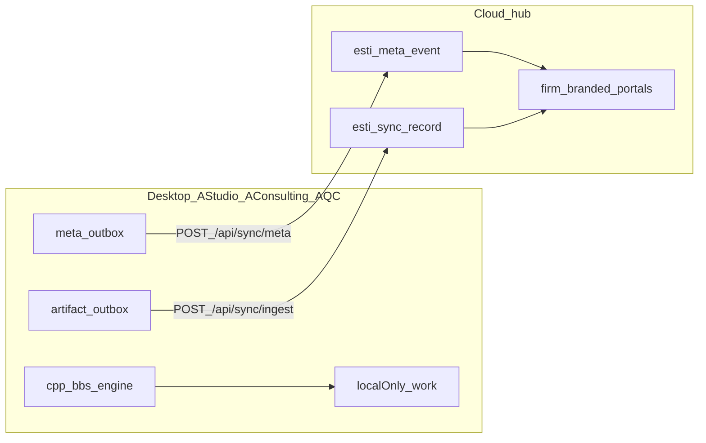

# AORMS local-first desktop + cloud hub

> **Canonical runtime law** · **Updated:** 2026-08-07 (desktop-native SaaS pivot)  
> Wire: [HUB-API.md](HUB-API.md) · Bridge: [PORTAL-SYNC-BRIDGE.md](PORTAL-SYNC-BRIDGE.md) ·  
> Repos: [DESKTOP-REPOS.md](DESKTOP-REPOS.md) · Licence: [PLANS-AND-TIERS.md](PLANS-AND-TIERS.md)

**Staff product is desktop-only.** AStudio and AConsulting ship as native Windows
apps forked from [AQC](https://github.com/HolagundiWorks/AQC) (WinUI 3 + C++
`bbs_engine`). **AProc = AQC.** Work, calculations, and AI stay on the machine.
The cloud hub holds **metadata · progress · numbers · final docs/drawings** for
**firm-branded portals**. `aorms.in` is **marketing + demos only** — no firm ERP
logins on the apex.

The esti monorepo staff SPA is a **reference archive** for IA/domain — not the
shipping staff UI. [DESKTOP-WEB-PARITY-UX.md](DESKTOP-WEB-PARITY-UX.md) is
**historical**.

**Licensing:** products stay **open source** for now (AQC AGPL community lineage).
**SaaS commercial licensing is deferred** — figure out later; do not block
engineering on SKUs.

## Decisions (locked)

| # | Choice |
| --- | --- |
| Staff runtime | **Native desktop only** (WinUI 3 + C++ engine) — no browser staff ERP |
| Engine SoT | **C++** `bbs_engine` (JSON C API) — every number from the deterministic engine |
| UI shell | **C# WinUI 3** (same stack as AQC) — do not discard AQC’s tested UI for a pure-C++ rewrite |
| Firm sync | **Cloud hub** is metadata + published-artifact authority (no LAN firm-server) |
| Online surface | **Firm-branded portals** (updates · progress · drawings · finals) + marketing/demos + License Manager |
| Design system (web) | **`@hcw/ui-kit`** on marketing + portals |
| Open source | **Keep OSS for now** — SaaS commercial licensing later |

## Three planes

| Plane | Lives where | Examples |
| --- | --- | --- |
| **Work / localOnly** | Desktop SQLite (local DB) | Drafts, BOQ lines, measurements, AI chats, scratch drawings |
| **Calculations** | C++ engine on desktop | BBS, quantities, estimate rollups — never recomputed in cloud |
| **Metadata** | Hub `esti_meta_event` | Tasks, status, cost scalars, progress % |
| **Artifacts** | Hub `esti_sync_record` + object store | READY drawings, issued PDFs, certified finals |

Classification: [`packages/contracts/src/sync.ts`](../../packages/contracts/src/sync.ts).  
Connector design: [PORTAL-SYNC-BRIDGE.md](PORTAL-SYNC-BRIDGE.md).

## Runtimes

| Runtime | Role |
| --- | --- |
| **AStudio / AConsulting / AQC desktop** | Authoring · calc · AI · local DB · `aorms_bridge` push |
| **Cloud hub** | Licence activate → `syncToken` · meta log · artifact store · firm portals |
| **`aorms.in`** | Marketing · wiki · blog · demos · downloads CTAs |
| **`admin.aorms.in`** | HCW License Manager |
| **Firm portal host** | Client / consultant / contractor / site — published data only |
| **esti staff SPA** | Reference only (not product) |

## Licence / sync scope

| Mode | Local AI / calc | Metadata sync | Artifact push |
| --- | --- | --- | --- |
| Unbound desktop | Yes | No | No |
| Licensed desktop (`ACTIVE`/`GRACE` + hub + syncToken) | Yes | Yes | Yes |
| Firm portal (web) | N/A | Read hub meta | Read published artifacts |

## Sibling repos

| Repo | Product |
| --- | --- |
| [HolagundiWorks/AQC](https://github.com/HolagundiWorks/AQC) | AProc — quantity / costing / BBS (engine source) |
| `HolagundiWorks/AStudio` | Architecture practice OS (fork AQC) |
| `HolagundiWorks/AConsulting` | Engineering practice OS (fork AQC) |

Agent scaffolds: [`docs/esti/repo-scaffolds/`](repo-scaffolds/).

## Historical LF waves (esti WebView2 era)

LF0–LF6 in this monorepo remain **engineering history** (contracts, hub sync,
WinUI+WebView2 bind). Shipping path moves to **AQC-lineage native apps** +
[PORTAL-SYNC-BRIDGE.md](PORTAL-SYNC-BRIDGE.md). See [ROADMAP.md](ROADMAP.md) § D-waves.

## Related

- [PORTAL-SYNC-BRIDGE.md](PORTAL-SYNC-BRIDGE.md) · [HUB-API.md](HUB-API.md)  
- [AORMS-SURFACE-URLS.md](AORMS-SURFACE-URLS.md) · [DESKTOP-REPOS.md](DESKTOP-REPOS.md)  
- [PLANS-AND-TIERS.md](PLANS-AND-TIERS.md) · [ROADMAP.md](ROADMAP.md)  
