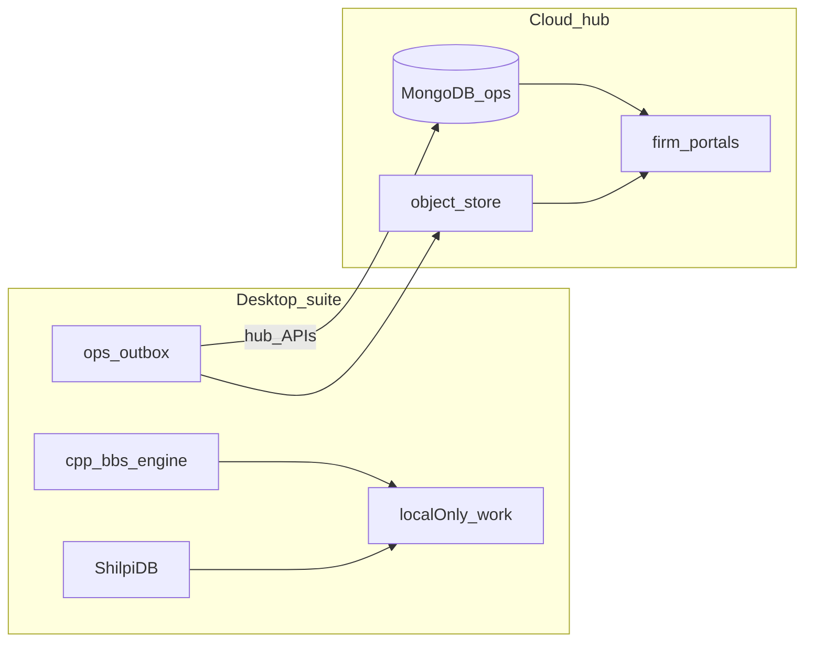

# AORMS local-first suite + cloud hub

> **Canonical implementation doc** for the dual-runtime product.  
> **Status (2026-08):** LF0–LF2 ✅ · **LF3** domain meta enqueue/apply ✅ (Gagan) ·
> LF4 packaging/bind open (Bhoomi) · LF5–LF6 open (Aakash).  
> Wire contract: [HUB-API.md](HUB-API.md) (`2026-08`) · contracts gate:
> [DESKTOP-REPOS.md](DESKTOP-REPOS.md) · crew: [AGENT-WORKSTREAMS.md](AGENT-WORKSTREAMS.md).  
> **Product law:** [PLANS-AND-TIERS.md](PLANS-AND-TIERS.md) · **UX parity:**
> [DESKTOP-WEB-PARITY-UX.md](DESKTOP-WEB-PARITY-UX.md) · **Identity:**
> [AORMS-IDENTITY.md](AORMS-IDENTITY.md) §10.

**AORMS is a product suite.** **AORMS Connect** is the desktop suite core
(login · launcher · shared project catalog · DB connector). Practice managers
(**AStudio** / **AConsulting**) and technical apps (**AQC Estimation** · **AQC BBS** ·
**AQC Project Management**) ship as native Windows apps launched from Connect.
**ADraft** drafts locally; **ShilpiDB** holds geometry; **MongoDB** holds all
non-drawing cloud ops/comms. Technical work and **ESTI AI stay on the machine**
(local Ollama / Foundry Local / opt-in keys inside desktop apps).
**Ollama does not run on the cloud hub or aorms.in VPS.** Firm-branded
**portals** + ops DB manager live online (no staff LLM runtime).

`aorms.in` is **marketing + blog** — no firm ERP logins on the apex.
Desktop firm login belongs in **Connect** ([AORMS-CONNECT.md](AORMS-CONNECT.md)).
**Soft launch (2026-08):** landing and blog live; apex `/login` and Windows
installers show **Coming soon** (`VITE_MARKETING_ONLY=true` by default on public builds).
Set `VITE_MARKETING_ONLY=false` and rebuild when demos reopen ([ROADMAP.md](ROADMAP.md) S8).

The esti monorepo staff SPA is a **reference archive** — not the shipping staff UI.

**Licensing:** open source for now; SaaS commercial licensing deferred.

## Decisions (locked)

| # | Choice |
| --- | --- |
| Suite shape | **Connect** + managers + three AQC installers + ADraft + ShilpiDB ([AORMS-SUITE.md](AORMS-SUITE.md)) |
| Desktop login | **AORMS Connect only** — suite apps launch with Connect session (C2 broker) |
| Staff runtime | **Native desktop** — no browser staff ERP |
| Engine SoT | **C++** `bbs_engine` — shared by Estimation / BBS / PM |
| Ops cloud | **MongoDB** (firm-scoped) — not CAD entities |
| Drawings | **ShilpiDB** — not Mongo |
| Firm sync | Hub APIs + `syncToken`; portals read published data only |
| **AI / ESTI** | **Desktop only** — local instruct (Ollama / Foundry Local / opt-in keys). **No hub Hosted AI · no VPS `esti-ollama` for product** |
| Design system (web) | **`@hcw/ui-kit`** on marketing + portals |
| Open source | Keep OSS for now |

## Planes

| Plane | Lives where | Examples |
| --- | --- | --- |
| **Work / localOnly** | Desktop SQLite | Drafts, BOQ lines, AI chats |
| **Calculations** | C++ engine on desktop | BBS, quantities — never recomputed in cloud |
| **Geometry** | ShilpiDB local / hosted | Entities, spatial queries, `.vdb`. ADraft: realtime tip sync **OFF**; local `COMMIT` / `SAVE` writes `%LocalAppData%\AADT\work\active.vdb`; upload only via `COMMIT PUSH` ([work-DB bridge](https://github.com/HolagundiWorks/AADT/blob/main/docs/architecture/aadt-shilpidb-architecture.md#interim-work-db-bridge-shipping-now)) |
| **Ops metadata** | MongoDB via hub | Tasks, status, progress %, portal threads |
| **Artifacts** | Object store + Mongo pointers | Issued PDFs, READY drawing packages |

## Runtimes

| Runtime | Role | Key env |
| --- | --- | --- |
| **Desktop node** | Preferred authoring path | `ESTI_ROLE=node`, `ESTI_DESKTOP=true`, `STORAGE_DRIVER=fs`, `INSTALL_ID`, local Ollama/EOMS |
| **Cloud hub** | Metadata SoT + published artifacts + portals + web SPA | `ESTI_ROLE=hub`, S3, licensing platform |
| **Web staff SPA** | Parity path (same SPA, hub API) | Browser → hub; AI/worker on hub (Hosted AI, unmetered) |

Packaging stub: [`desktop/`](../../desktop/) · env: `desktop/env.desktop.example`.

## Licence / sync scope

| Mode | Local AI / calc | Ops sync | Artifact push |
| --- | --- | --- | --- |
| Free / unbound desktop | Yes | No | No |
| Licensed desktop (`VALID`/`GRACE` + hub + syncToken) | Yes | Yes | Yes |
| Web parity | Hub (Hosted AI) | Yes | Server-side |

Runtime resolution: `trpc.sync.capabilities` ·
[`backend/src/lib/sync/runtimeCapabilities.ts`](../../backend/src/lib/sync/runtimeCapabilities.ts)
(server) · [`frontend/src/lib/runtimeCapabilities.ts`](../../frontend/src/lib/runtimeCapabilities.ts)
(SPA badges / host). Desktop sync caps require licence + hub URL + `syncToken`.

## Implementation waves

| Wave | Focus | Status |
| --- | --- | --- |
| **LF0** | Contracts: planes, `MetaEntity`, field maps, capability presets, tests | ✅ |
| **LF1** | Hub `esti_meta_event` + catch-up REST + WS; node meta outbox/cursor; drain tick | ✅ |
| **LF2** | Artifact content-hash; publish DTOs (tender/RA/siteReference/progressReport); portal-from-hub reads | ✅ |
| **LF3** | Domain enqueue of metadata (tasks, estimate totals, phase progress) + apply hooks on pull | ✅ Gagan 2026-08 |
| **LF4** | Signed desktop installer (Tauri + bundled/sidecar Postgres·worker·Ollama); first-run licence bind | 🔲 Bhoomi |
| **LF5** | Web parity polish: capability badges, degraded AI UX, shared keymap / Help | 🔲 Aakash |
| **LF6** | UX parity checklist + inspector/AI right-slot; Figma token sync to kit | 🔲 Aakash |

**Migrations:** `0226_local_first_sync.sql` · `0227_hlp_org_sync_firm.sql` (panel sync firm UUID).

## Key APIs & modules

| Surface | Path |
| --- | --- |
| Wire contract | [HUB-API.md](HUB-API.md) (`2026-08`) |
| Artifact ingest | `POST /api/sync/ingest` — [`routes.ts`](../../backend/src/modules/sync/routes.ts) |
| Meta append / catch-up / WS | `/api/sync/meta*` — same |
| Node tRPC | `sync.status` · `flush` · `enqueueMeta` · `pullMeta` · `capabilities` · `hubConfigured` |
| Panel activate → sync bearer | `/platform/v1/activate` · `license.activate` ([HUB-API.md](HUB-API.md)) |
| Meta lib | [`backend/src/lib/sync/metadata.ts`](../../backend/src/lib/sync/metadata.ts) |
| LF3 domain enqueue/apply | [`backend/src/lib/sync/domainMeta.ts`](../../backend/src/lib/sync/domainMeta.ts) |
| Artifact outbox | [`backend/src/lib/sync/outbox.ts`](../../backend/src/lib/sync/outbox.ts) |
| Publish DTOs | [`backend/src/lib/sync/publish.ts`](../../backend/src/lib/sync/publish.ts) |
| Hub portal reads | [`backend/src/lib/sync/hubPortal.ts`](../../backend/src/lib/sync/hubPortal.ts) |
| Sync queue chrome | [`SyncQueueChip.tsx`](../../frontend/src/components/SyncQueueChip.tsx) |

## Conflict policy

- Task/status-like fields: **LWW per field** (`updatedAt` + actor)
- Derived money / progress scalars: **server seq wins** (`conflict: "serverSeq"`)

## What must not sync

- AI transcripts / model weights
- Measurement scratch / nested estimate lines (until finalize)
- Draft drawings and unissued PDFs

## Operator notes

- Empty `ESTI_HUB_URL` = offline-only node (no meta/artifact push).
- Hub portals prefer `esti_sync_record` when `ESTI_ROLE=hub`; nodes keep live-table reads.
- File mirror on ingest is best-effort when node and hub share object keys; content-hash skips unchanged bytes.

## Related

- [HUB-API.md](HUB-API.md) · [DESKTOP-REPOS.md](DESKTOP-REPOS.md) · [AGENT-WORKSTREAMS.md](AGENT-WORKSTREAMS.md)  
- [ROADMAP.md](ROADMAP.md) § Local-first  
- [PLANS-AND-TIERS.md](PLANS-AND-TIERS.md)  
- [DESKTOP-WEB-PARITY-UX.md](DESKTOP-WEB-PARITY-UX.md)  
- [AORMS-IDENTITY.md](AORMS-IDENTITY.md) §10  
- [ARCHITECTURE.md](ARCHITECTURE.md)  
