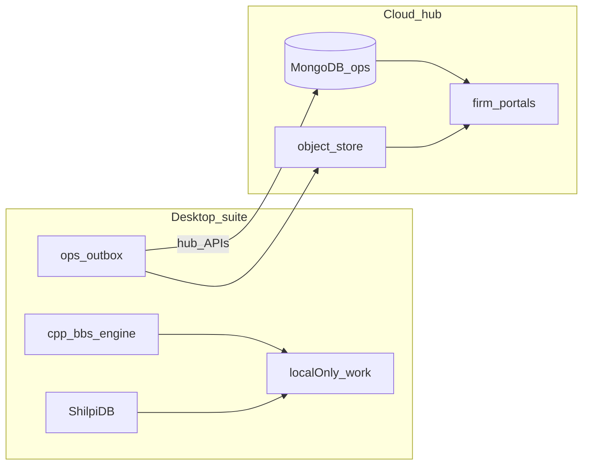

# AORMS local-first suite + cloud hub

> **Canonical runtime law** · **Updated:** 2026-08-09 (desktop-only AI)  
> Suite: [AORMS-SUITE.md](AORMS-SUITE.md) · Wire: [HUB-API.md](HUB-API.md) ·  
> Bridge: [PORTAL-SYNC-BRIDGE.md](PORTAL-SYNC-BRIDGE.md) · Repos: [DESKTOP-REPOS.md](DESKTOP-REPOS.md) ·  
> Roadmap: [ROADMAP.md](ROADMAP.md)

**AORMS is a product suite.** **AORMS Connect** is the desktop suite core
(login · launcher · shared project catalog · DB connector). Practice managers
(**AStudio** / **AConsulting**) and technical apps (**AQC Estimation** · **AQC BBS** ·
**AQC Project Management**) ship as native Windows apps launched from Connect.
**AADT** drafts locally; **ShilpiDB** holds geometry; **MongoDB** holds all
non-drawing cloud ops/comms. Technical work and **ESTI AI stay on the machine**
(local Ollama / Foundry Local / opt-in keys inside desktop apps).
**Ollama does not run on the cloud hub or aorms.in VPS.** Firm-branded
**portals** + ops DB manager live online (no staff LLM runtime).

`aorms.in` is **marketing + blog** — no firm ERP logins on the apex.
Desktop firm login belongs in **Connect** ([AORMS-CONNECT.md](AORMS-CONNECT.md)).
**Soft launch (2026-08):** landing and blog live; apex `/login` and Windows
installers show **Coming soon** (`VITE_MARKETING_ONLY=true` by default on public builds).
Set `VITE_MARKETING_ONLY=false` and rebuild when demos reopen ([ROADMAP.md](ROADMAP.md) S8).

The esti monorepo staff SPA is a **reference archive** — not the shipping staff UI.

**Licensing:** open source for now; SaaS commercial licensing deferred.

## Decisions (locked)

| # | Choice |
| --- | --- |
| Suite shape | **Connect** + managers + three AQC installers + AADT + ShilpiDB ([AORMS-SUITE.md](AORMS-SUITE.md)) |
| Desktop login | **AORMS Connect only** — suite apps launch with Connect session (C2 broker) |
| Staff runtime | **Native desktop** — no browser staff ERP |
| Engine SoT | **C++** `bbs_engine` — shared by Estimation / BBS / PM |
| Ops cloud | **MongoDB** (firm-scoped) — not CAD entities |
| Drawings | **ShilpiDB** — not Mongo |
| Firm sync | Hub APIs + `syncToken`; portals read published data only |
| **AI / ESTI** | **Desktop only** — local instruct (Ollama / Foundry Local / opt-in keys). **No hub Hosted AI · no VPS `esti-ollama` for product** |
| Design system (web) | **`@hcw/ui-kit`** on marketing + portals |
| Open source | Keep OSS for now |

## Planes

| Plane | Lives where | Examples |
| --- | --- | --- |
| **Work / localOnly** | Desktop SQLite | Drafts, BOQ lines, AI chats |
| **Calculations** | C++ engine on desktop | BBS, quantities — never recomputed in cloud |
| **Geometry** | ShilpiDB local / hosted | Entities, spatial queries, `.vdb`. AADT: realtime tip sync **OFF**; local `COMMIT` / `SAVE` writes `%LocalAppData%\AADT\work\active.vdb`; upload only via `COMMIT PUSH` ([work-DB bridge](https://github.com/HolagundiWorks/AADT/blob/main/docs/architecture/aadt-shilpidb-architecture.md#interim-work-db-bridge-shipping-now)) |
| **Ops metadata** | MongoDB via hub | Tasks, status, progress %, portal threads |
| **Artifacts** | Object store + Mongo pointers | Issued PDFs, READY drawing packages |

## Runtimes

| Runtime | Role |
| --- | --- |
| **AStudio / AConsulting** | Practice managers — Tasks · Office · HR · Payroll · comms |
| **AQC Estimation / BBS / PM** | Technical apps — shared `bbs_engine` |
| **AADT** | 2D drafting |
| **ShilpiDB** | Geometry spine (+ desktop manager) |
| **Cloud hub** | Licence · Mongo ops · artifacts · portals · ops DB manager — **no LLM / Ollama** |
| **`aorms.in`** | Marketing · demos · downloads — **no Ask ESTI cloud runtime** |
| **esti staff SPA** | Reference archive only (legacy AI routes are not the shipping surface) |

## Licence / sync scope

| Mode | Local AI / calc | Ops sync | Artifact push |
| --- | --- | --- | --- |
| Unbound desktop | Yes | No | No |
| Licensed + `syncToken` | Yes | Yes → Mongo | Yes |
| Firm portal | N/A | Read Mongo | Read published |

## Sibling repos

| Repo | Product |
| --- | --- |
| [AQC](https://github.com/HolagundiWorks/AQC) | Engine + three technical app packaging |
| [AStudio](https://github.com/HolagundiWorks/AStudio) | Architecture practice manager |
| [AConsulting](https://github.com/HolagundiWorks/AConsulting) | Engineering practice manager |
| [AADT](https://github.com/HolagundiWorks/AADT) | 2D drafting |
| [shilpidb](https://github.com/HolagundiWorks/shilpidb) | Geometry store |
| esti / aorms | Hub · portals · marketing · contracts |

## Related

- [AORMS-SUITE.md](AORMS-SUITE.md) · [PORTAL-SYNC-BRIDGE.md](PORTAL-SYNC-BRIDGE.md) · [HUB-API.md](HUB-API.md)  
- [DESKTOP-REPOS.md](DESKTOP-REPOS.md) · [ROADMAP.md](ROADMAP.md) · [MONGO-OPS.md](MONGO-OPS.md)  
