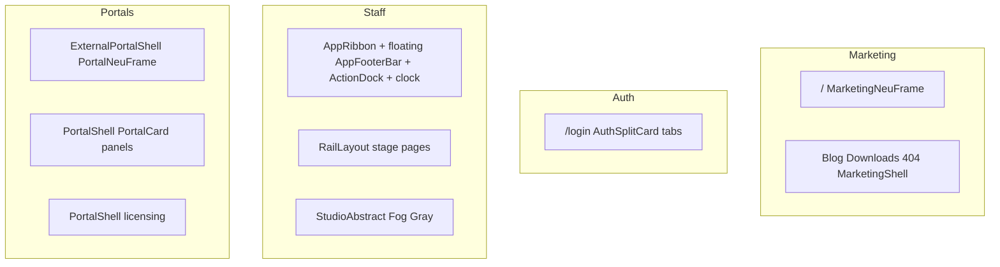

# AORMS — UI site map (chrome by surface)

**Status:** Canonical inventory · **Updated:** 2026-08-09 · **Wave 1–8 chrome + UX audit W1–W2:** closed  
**Canon:** [PAGE-STRUCTURE.md](PAGE-STRUCTURE.md) · [HCW-UI-KIT.md](HCW-UI-KIT.md) · [HCW-UX.md](../HCW-UX.md) · [AORMS-SURFACE-URLS.md](AORMS-SURFACE-URLS.md)

One language everywhere: **no left rail · soft neu top bar · Fog Gray canvas · 8px radius · one clock · dock only where staff**.

## Unified login (`/login`)

Single horizontal soft card (`AuthRailLayout` + `AuthSplitCard`). Tabs stay pinned;
form body scrolls inside the fixed-height card.

| Tab | Query | Audience | Success |
| --- | --- | --- | --- |
| Workspace | `/login` | Firm staff | Destination picker → workspace / account / company |
| Portals | `?tab=portals` | Client · consultant · contractor · site | Portal `/` |
| Account | `?tab=account` | AORMS account | `/account` |
| → Company | `?scope=company` | Firm owners | `/company-account` |
| → Licensing | `?scope=licensing` | HCW operators | `/platform-admin` |

**Redirects into this page:** `/access` → Portals · unauthenticated `/account` → Account · unauthenticated `/company-account` → Company scope · unauthenticated `/platform-admin` → Licensing scope.

**Not folded:** self-hosted `/signup` (one-time firm bootstrap).

## Surface table

| Surface | Routes | Shell | Content width | Top bar | Bottom | Clock | Left rail |
| --- | --- | --- | --- | --- | --- | --- | --- |
| Marketing | `/`, blog, downloads, 404 | `MarketingNeuFrame` / `MarketingShell` | 1200px | soft sticky · AormsLogo | `MarketingLandingDock` | Pomodoro clock | No |
| Auth | `/login` (+ legacy `/access`); forgot/reset/force-pw; `/signup` bootstrap only | `AuthRailLayout` + `AuthSplitCard` | horizontal 1200px | `MarketingTopBar` | none | AnalogueClock | No |
| Staff (AStudio) | office, library, projects, … | `.esti-app-shell2` + `AppRibbon` + `RailLayout` | full + gutters | soft sticky · brand · search · greeting · alerts | floating 60px `AppFooterBar` (nav) + ActionDock | `MarketingClockPomodoro` 100px | No |
| Staff (AConsulting) | `/consultancy/*` on consultancy host | same staff shell · `consultancyNav` | full | same ribbon | same floating footer + dock | same clock | No |
| Staff (AProc) | `/pmc` on proc host | same staff shell · `pmcNav` + `PmcHome` | full | same ribbon | footer home → `/pmc` + dock | same clock | No |
| Studio home | `/` on studio | `StudioAbstract` | full | soft AppRibbon | floating footer + dock | same clock | No |
| External portals | client / consultant / contractor / site | `PortalNeuFrame` + `PORTAL_CHROME` | 1200px | soft top · floating 60px footer | ActionDock on **all four** roles (client · collaborator · contractor · site) | `AormsAnalogueClock` 100px | No |
| Account hubs | `/account`, `/company-account` | `PortalNeuFrame` + soft `PortalCard` | 1200px | soft sticky · logo → home · hub nav | none | `AormsAnalogueClock` | No |
| Licensing admin | `/platform-admin` | `PortalShell` + horizontal sections | 1200px | portal top bar | none | `AormsAnalogueClock` | No |

## Closed waves (2026-08-07)

**Wave 1** — soft sticky AppRibbon · single AnalogueClock · Fog Gray studio home · AuthRailLayout · PortalNeuFrame · admin horizontal chips  

**Wave 2** — site Sign out · Soft Surface portal tiles · AConsulting tabs · AProc `PmcHome` · in-flow shell padding · contractor branding  

**Wave 3** — 8px neu-button + wellness radii · remove staff watermark · delete `MarketingRailNav` / `MarketingConversionDock` / `PublicAuthStageLayout` · purge `.lp2-rail` / portal-rail CSS · docs sync  

**Wave 4** — Studio brief `Surface soft` · `--esti-neu-fill` = kit `NEU_FILL` (#eceef2 soft raised, Fog Gray remains canvas)  

**Wave 5** — `COMPOSITION_RHYTHM` on all shells (`RailLayout` · Studio · portals · auth · ribbon · admin) · staff gutter 24px  

**Wave 6** — `AormsMark` in AppRibbon · de-Carbon shared widgets · ProjectDetail odd groups  
**2026-08-09** — Suite IA: taskbar People/Office/Finance · Studio Focus/Portfolio/Practice · Work Execute/Coordinate/Capacity · Project Setup/Design/Commercial/Site · Brief/Drawings/Documents on `ProjectFacetTabs`  

**Wave 7** — Unified `/login` tabs (Workspace · Portals · Account + scopes) · account hub `PortalCard` soft panels · denser building entourage  

**Wave 8** — Plain Studio Intelligence stage — remove `StudioBreath` contour ambient; Fog Gray canvas only  

**Wave D4** — Firm portal shell (`FirmPortalShell`: Updates · Project · Progress · Drawings · Documents) · marketing apex CTAs → downloads / demos (not firm ERP login)

## Deferred (optional)

- Knowledge Bank public vs staff path clarification  
- Remaining company-admin / platform-admin Carbon panels (storage, migration, dashboard tabs, etc.)  
