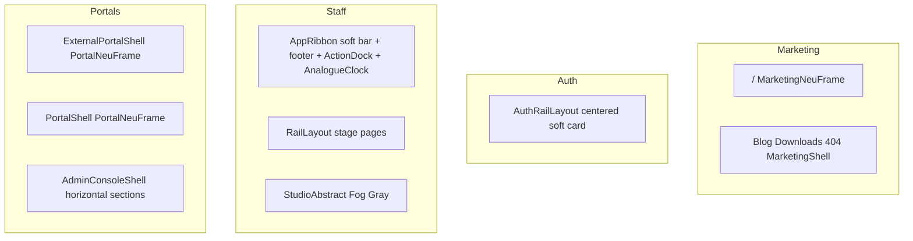

# AORMS — UI site map (chrome by surface)

**Status:** Canonical inventory · **Updated:** 2026-08-07 · **Wave 1 + Wave 2 chrome:** closed  
**Canon:** [PAGE-STRUCTURE.md](PAGE-STRUCTURE.md)

One language everywhere: **no left rail · soft neu top bar · Fog Gray canvas · one clock · dock only where staff**.

## Surface table

| Surface | Routes | Shell | Content width | Top bar | Bottom | Clock | Left rail |
| --- | --- | --- | --- | --- | --- | --- | --- |
| Marketing | `/`, blog, downloads, 404 | `MarketingNeuFrame` / `MarketingShell` | 1200px | soft sticky | `MarketingLandingDock` | Pomodoro clock | No |
| Auth | `/login`, `/access`, signup, forgot/reset, force-pw, admin login | `AuthRailLayout` | ~420px card | none (card brand) | none | none | No |
| Staff (AStudio) | office, library, projects, … | `.esti-app-shell2` + `AppRibbon` + `RailLayout` | full + gutters | soft sticky neu bar | footer + ActionDock | AnalogueClock only | No |
| Staff (AConsulting) | `/consultancy/*` on consultancy host | same staff shell · `consultancyNav` | full | soft sticky | footer + dock | AnalogueClock | No |
| Staff (AProc) | `/pmc` on proc host | same staff shell · `pmcNav` + `PmcHome` | full | soft sticky | footer home → `/pmc` | AnalogueClock | No |
| Studio home | `/` on studio | `StudioAbstract` | full | soft AppRibbon | footer + dock | AnalogueClock | No |
| External portals | client / consultant / contractor / site | `PortalNeuFrame` | 1200px | identity + Sign out | none | AnalogueClock | No |
| Account hubs | `/account`, `/company-account` | `PortalNeuFrame` | 1200px | hub nav + Sign out | none | AnalogueClock | No |
| Licensing admin | `/platform-admin` | `PortalShell` + horizontal sections | 1200px | portal top bar | none | AnalogueClock | No |

## Wave 1 closed (2026-08-07)

- Staff ribbon: soft sticky neu bar (float retired)
- Single AnalogueClock (footer tray digital clock removed)
- Studio home Fog Gray (white special-case removed)
- Auth: centered `AuthRailLayout` only (no marketing dock on sign-in)
- Admin console: horizontal section chips (left nav removed)

## Wave 2 closed (2026-08-07)

- Site portal: Sign out + full stage width
- External portal identity fallback uses portal label (not AStudio)
- Client / consultant / contractor tiles: soft `Surface` (8px)
- Consultant list: `DataState` empty/loading parity with client
- Licensing admin loading uses `PortalShell`
- AConsulting: Enquiries/Engagements as horizontal `tabs` (not stacked header actions); AConsulting naming
- AProc: mount `PmcHome` at `/pmc`, proc host routing, `pmcNav`, footer home works
- Staff content: drop float-era `padding-top: --esti-header-height` (ribbon is in-flow)

## Deferred (document only)

- Delete unused `MarketingRailNav` / dead `.lp2-rail` / orphaned portal-rail CSS
- Knowledge Bank public vs staff path clarification
- Carbon spike isolation; de-Carbon shared portal widgets (`RowActionsMenu`, `SubmissionThread`, `ProjectSiteReference`) and company-admin / licensing Carbon tabs
- StudioAbstract brief → soft `Surface` stage header (hand-rolled brief strip remains)
