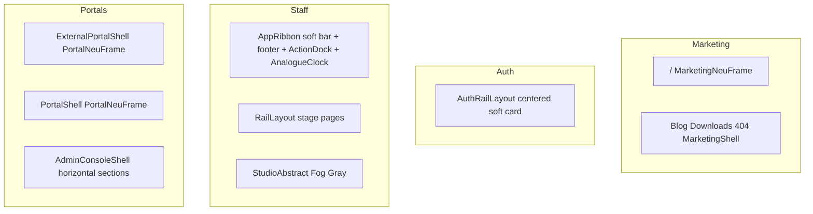

# AORMS — UI site map (chrome by surface)

**Status:** Canonical inventory · **Updated:** 2026-08-07 · **Wave 1–4 chrome:** closed  
**Canon:** [PAGE-STRUCTURE.md](PAGE-STRUCTURE.md) · [HCW-UI-KIT.md](HCW-UI-KIT.md) · [HCW-UX.md](../HCW-UX.md)

One language everywhere: **no left rail · soft neu top bar · Fog Gray canvas · 8px radius · one clock · dock only where staff**.

## Surface table

| Surface | Routes | Shell | Content width | Top bar | Bottom | Clock | Left rail |
| --- | --- | --- | --- | --- | --- | --- | --- |
| Marketing | `/`, blog, downloads, 404 | `MarketingNeuFrame` / `MarketingShell` | 1200px | soft sticky · AormsLogo | `MarketingLandingDock` | Pomodoro clock | No |
| Auth | `/login`, `/access`, signup, forgot/reset, force-pw, admin login | `AuthRailLayout` | ~440px card | `MarketingTopBar` (logo → landing) | none | AnalogueClock (no Pomodoro) | No |
| Staff (AStudio) | office, library, projects, … | `.esti-app-shell2` + `AppRibbon` + `RailLayout` | full + gutters | soft sticky · mark + firm name | footer + ActionDock | AnalogueClock only | No |
| Staff (AConsulting) | `/consultancy/*` on consultancy host | same staff shell · `consultancyNav` | full | soft sticky | footer + dock | AnalogueClock | No |
| Staff (AProc) | `/pmc` on proc host | same staff shell · `pmcNav` + `PmcHome` | full | soft sticky | footer home → `/pmc` | AnalogueClock | No |
| Studio home | `/` on studio | `StudioAbstract` | full | soft AppRibbon | footer + dock | AnalogueClock | No |
| External portals | client / consultant / contractor / site | `PortalNeuFrame` | 1200px | identity + Sign out | none | AnalogueClock | No |
| Account hubs | `/account`, `/company-account` | `PortalNeuFrame` | 1200px | hub nav + Sign out | none | AnalogueClock | No |
| Licensing admin | `/platform-admin` | `PortalShell` + horizontal sections | 1200px | portal top bar | none | AnalogueClock | No |

## Closed waves (2026-08-07)

**Wave 1** — soft sticky AppRibbon · single AnalogueClock · Fog Gray studio home · AuthRailLayout · PortalNeuFrame · admin horizontal chips  

**Wave 2** — site Sign out · Soft Surface portal tiles · AConsulting tabs · AProc `PmcHome` · in-flow shell padding · contractor branding  

**Wave 3** — 8px neu-button + wellness radii · remove staff watermark · delete `MarketingRailNav` / `MarketingConversionDock` / `PublicAuthStageLayout` · purge `.lp2-rail` / portal-rail CSS · docs sync  

**Wave 4** — Studio brief `Surface soft` · `--esti-neu-fill` = kit `NEU_FILL` (#eceef2 soft raised, Fog Gray remains canvas)  

**Wave 5** — `COMPOSITION_RHYTHM` on all shells (`RailLayout` · Studio · portals · auth · ribbon · admin) · staff gutter 24px  

**Wave 6** — `AormsMark` in AppRibbon · de-Carbon shared widgets (`RowActionsMenu`, `SubmissionThread`, `ProjectSiteReference`, `AdminSection`, `PortalLicenceCard`, `LicensePanel`) · ProjectDetail odd groups (Setup 3 · Design 5 · Delivery gated)  

## Deferred (optional)

- Knowledge Bank public vs staff path clarification  
- Remaining company-admin / platform-admin Carbon panels (storage, migration, dashboard tabs, etc.)  
